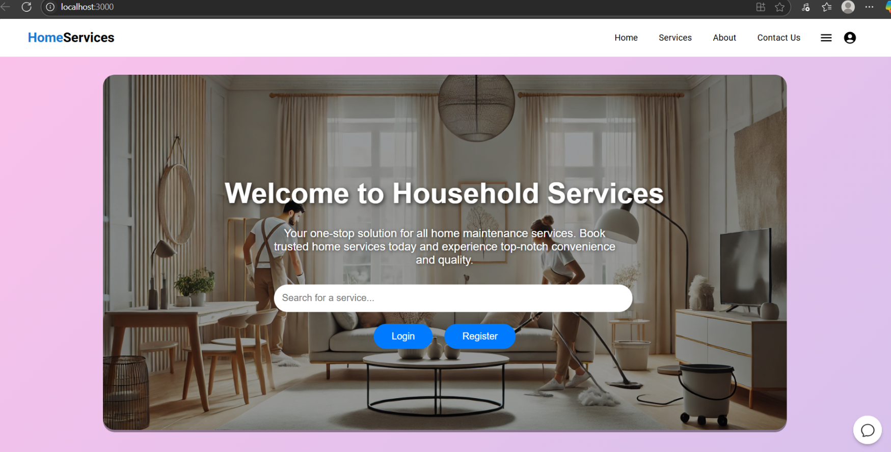
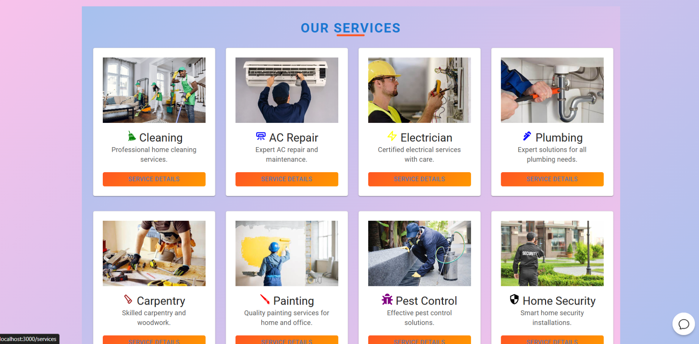
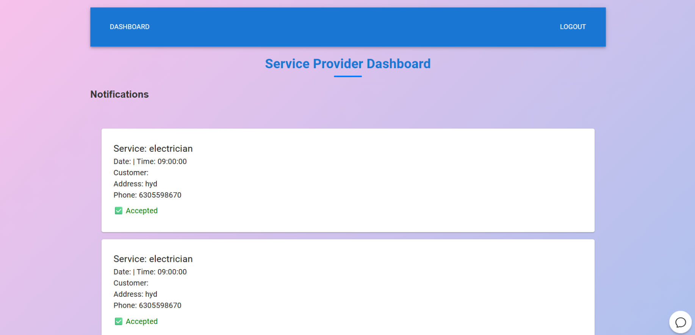
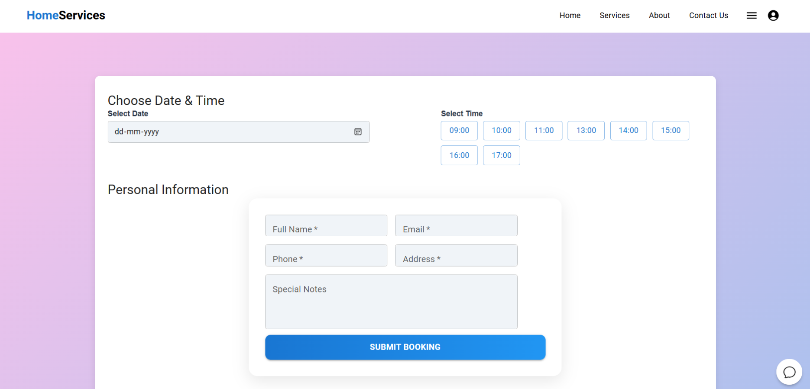
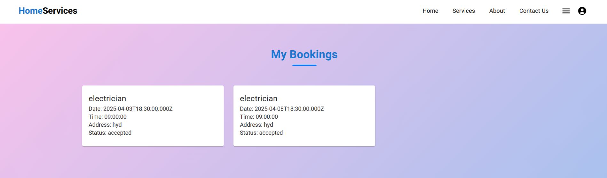

# 🏠 Household Services Web App

A **full-stack web application** for booking household services like plumbing, electrical work, cleaning, and more.  

The platform supports two types of users:

- **Service Seekers (Users)**
- **Service Providers**

Each user type gets a **custom dashboard** and workflow designed specifically for their role.

---

##  Tech Stack

### Frontend
- React
- JavaScript

### Backend
- Node.js
- Express.js

### Database
- PostgreSQL

### Other Technologies
- REST APIs
- bcrypt (for secure password hashing)

---

##  Features

###  Authentication
- User Registration & Login
- Service Provider Registration & Login
- Secure password hashing using **bcrypt**

---

###  For Users (Service Seekers)

- Browse and **book household services** (plumbing, cleaning, electrical, etc.)
- **Cancel service bookings**
- **Rate service providers**
- Provide feedback about the overall service experience

---

###  For Service Providers

- Register and login as a **service provider**
- Access a **personalized provider dashboard**
- View **upcoming service bookings**
- **Accept or reject booking requests** from users

---

##  Screenshots

###  Home Page

###  Services Page

###  Dashboard

###  Booking Page

###  My Bookings

---

## 🔮 Future Improvements

###  Admin Dashboard
Develop a dedicated **admin panel** to manage:
- Users
- Service providers
- Services
- Reported issues

---

###  Email Notifications
Implement automated **email notifications** for:
- New bookings
- Booking cancellations
- Status updates

---

###  Real-Time Updates
Integrate **Socket.io** to provide:

- Real-time booking status updates
- Live notifications
- Chat functionality between users and providers

---

##  Conclusion

This project demonstrates a **full-stack service marketplace platform** with role-based dashboards, secure authentication, and booking management. It can be further extended with real-time communication, an admin panel, and scalable microservices architecture.

---

⭐ If you like this project, consider giving it a **star on GitHub**!

(Add your screenshots here)
